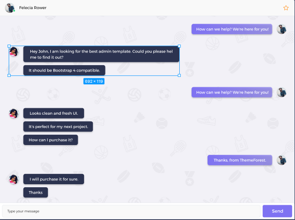

# Bhanta 

Bhanta is a real time chat app built using React and Firebase.

Bhanta allows to send and receive text messages

<h3 align="center">

</h3>

## Compatibility

This project is written in ReactJS and Firebase 9.

## Author

* [Richd0tcom](https://twitter.com/0xRICHd0tCom)

## License

Copyright 2019 Richd0tcom.

Licensed under MIT License: https://opensource.org/licenses/MIT
